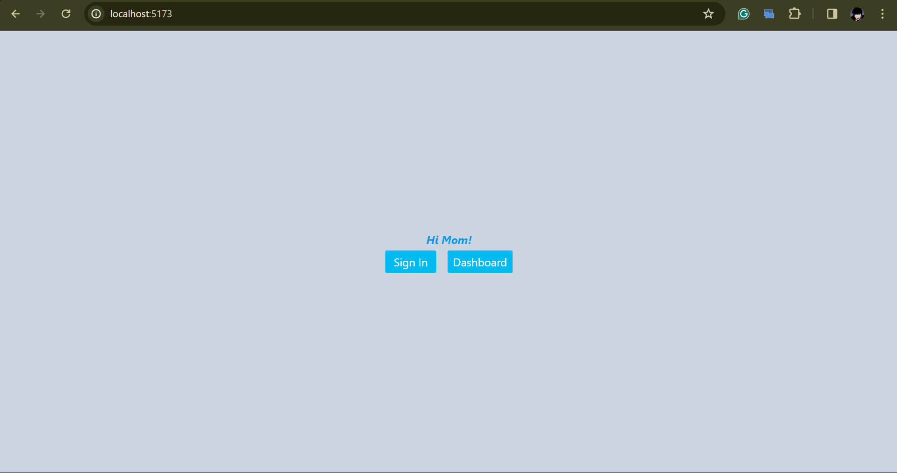
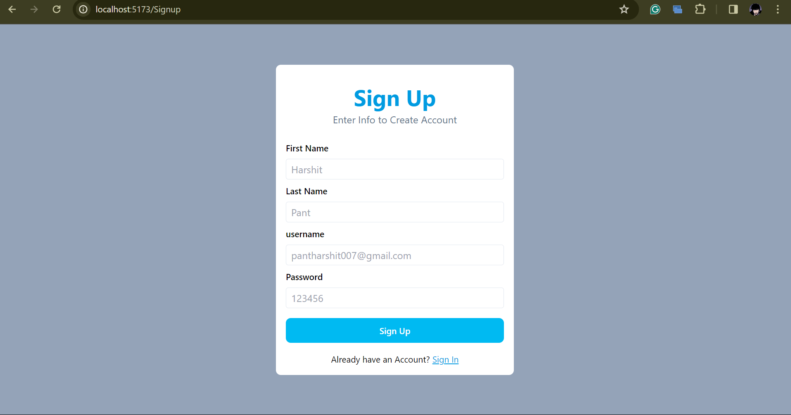
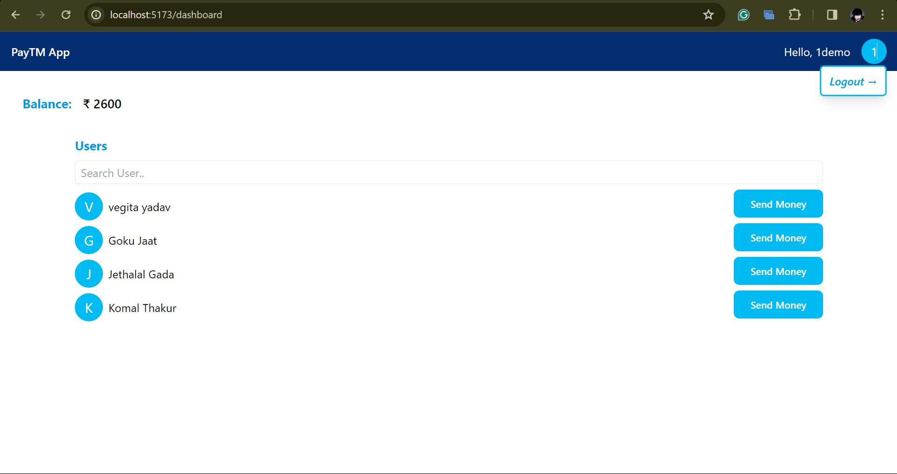
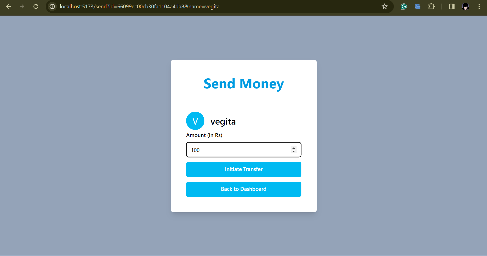

# paymentApp

A simple demo payment app inspired by payTM.

## Table of Contents

- [Installation](#installation)
- [Usage](#usage)
- [Features](#features)
- [Images](#images)
- [Contributing](#contributing)
- [Todo](#todo)

## Installation

1. Clone the repository.

   ```bash
   git clone https://github.com/pantharshit007/paymentApp
   ```

2. Navigate to the project directory in 2 different Terminal.

   ```bash
   cd frontend
   ```

   ```bash
   cd backend
   ```

3. Install dependencies.
   ```bash
   npm install
   ```

## Usage

In order to run the app on your system you will be required to have a MongoDB url handy and other environment variables. You will be able to find them in `.env.example` file in **/backend**

```
MONGODB_URL =
PORT =
JWT_SECRET =
```

**Remember I used `PORT=4000` and called all backend calls using it so use this until you change it in `FE`**

Once all requirements are full-filled just run the below command in both terminals:

```
npm run dev
```

> hope you won't stuck on any error even if you do it will be most likely in the backend. ✨

## Features

- user can create an account (`SignIn/Signup`)
- transfer money to different users (Dynamic Searching)
- User authentication via `jwt` token
- proper notification or error/successful events

## Images

- _Home_



- _SignIn_


- _SignUp_



- _Dashboard_



- _Send Money_



## Contributing

If you'd like to contribute to this project, please follow these guidelines:

1. Fork the repository.
2. Create a new branch (`git checkout -b feature-branch`).
3. Make your changes.
4. Commit your changes (`git commit -am 'Add new feature'`).
5. Push to the branch (`git push origin feature-branch`).
6. Create a new Pull Request.

## Todo

- Enable OTP based Authentication of Email, so that DB doesn't populate with random test emails
- This will be easier since the first TODO is done: send a mail to the user's email every time a transaction is initiated.
- Implement Debouncing on User Search.

## धन्यवाद (Thankyou) ✨

---
